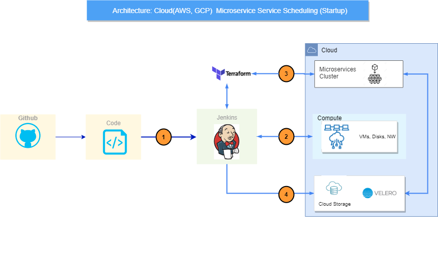
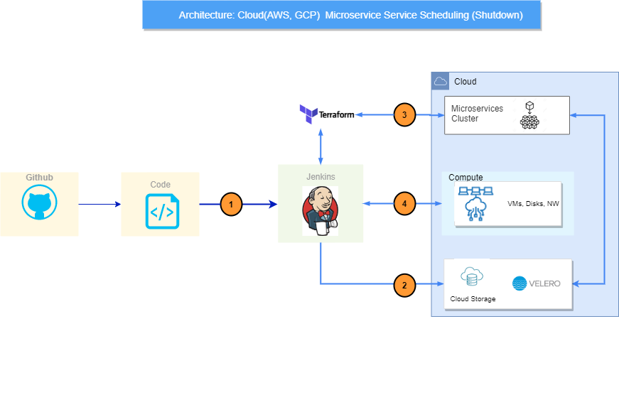

## Cloud Capacity Management ☁️ 💰

## Inspiration for the Product:

Nowadays, organizations are depending upon the cloud computing technology offered by various cloud providers in the market. The Organization’s operations and usage entirely depend on the services provided by the various cloud providers and vendors. As the usage of services increases the cloud costs will also increase. In a study, it has been revealed that about 60% of the organizations who actively maintain their workloads in cloud are looking to reduce their cloud expenditure to furthermore while keeping low business impact. We noticed that many organizations are investing on idle resources in non-production environments and during non-business window. We see the opportunity to reduce these costs without impacting the business and further cut-down the cloud costs.

## Our Approach:

Under the “Cloud Capacity Management” offering, we took the challenge of reducing the organizations cloud costs while utilizing the cloud resources in an effective manner. After researching different ways and different techniques to keep the costs occurring for compute services low when they are in idle mode, we came up with the idea of a scheduler which can shut down and start-up these compute services automatically in defined time-period. On a compute instance, depends on the active period we can save up to 60% by actively managing this active period.

We are mainly aiming to implement this for non-production environments such as Dev, QA, UAT, staging etc. where the probability of having the idle compute resources during non-active periods is high and any interruption with these systems will have low impact on business.

## Our Development Process:

Our journey with development initially started with targeting only traditional compute instances in both Amazon Web Services and Google Cloud Platform. Under this we managed to provide a solution which can be configured with the specific compute instance details and scheduling times to start-up and shut down automatically. This solution can be configured in many ways. For example, we can configure it as a basic cron job in an on-premises or cloud VM or as a pipeline job in any automation tool such as Jenkins, Azure Pipelines, GitHub actions etc.

During our journey, we noticed that compute instances that are part of the managed clusters for container-based solutions can also be maintained in above manner but shutting down the compute instance attached to any managed cluster would create issues maintaining that container application. So, to tackle with this problem, we must destroy the cluster entirely and re-create it automatically just before the active period begins. By following this approach, we can further reduce the costs with typical managed cluster costs as well. The steps to shut down and start-up the clusters automatically follows below procedure:

1.  Take the backup of the container-based solution along with their status, data, and configurations running in the managed cluster (such as EKS in AWS and GKE in GCP) using any disaster recovery tool and store it in any cloud storage solution.
2.  Once the backup is successful, destroy the current setup by using any scripts, configuration management tool or provisioning tool to cut the costs occurring during non-active window.
3.  Before the active window resumes, create the same setup (cluster and its configurations) through the scripts or provisioning tool along with valid roles and permissions and wait till they are completely up and running without any issues.
4.  Once the cluster setup is ready, restore the backup taken before and ensure it is deployed successfully.

The design overview of our solution and approach is shown below:

## Product Benefits:

Below are the benefits of our solution:

1.  **Cloud cost reduction:** By implementing this solution and following this approach would lead to significant reduction in monthly cloud operating costs.
2.  **Flexible Configuration:** It is easy to setup and configure solution. We can update the compute services list, scheduling times easily through the scripts and provided templates.
3.  **Customizable Templates for any tool stack:** Current version include Jenkins pipelines to implement the solution, but it can be customized to any other automation tool.
4.  **Backup and restoration tool:** Optionally, we can use this as a simple backup and restoration tool for managed clusters in cloud platforms. You can either backup or restore on-demand or through scheduled times.

## Challenges we faced:

There are quite several challenges we faced while implementing this solution. The main challenge is with authentication of cloud platforms through CLI methods for easier interaction to cloud resources, proper roles & permission sets to mange the cloud resources and several tools setup and integrations. We tried several disaster recovery management tools which can match our requirements for backup and restore strategy with managed cluster. This solution includes steps for achieving it through “Velero” software, a CLI based tool to back up the cluster info, data, and configurations to a cloud storage solution and restore the same when needed.

## Expectations in upcoming versions:

The future versions will include configurations and relevant templates for other cloud platforms such as Azure. We are aiming to improve the current versions while including more cost optimizing solutions.

**Built with:**

Cron Job, IaaC Templates, Groovy script, Jenkins, Terraform, and Velero.

**Try it out:**

Try this solution by using the provided installation and setup guide.

Installation guide - [Installation Guide.docx](https://github.com/CR-Digital-Innovation/cloud-capacity-management/tree/main/docs)
